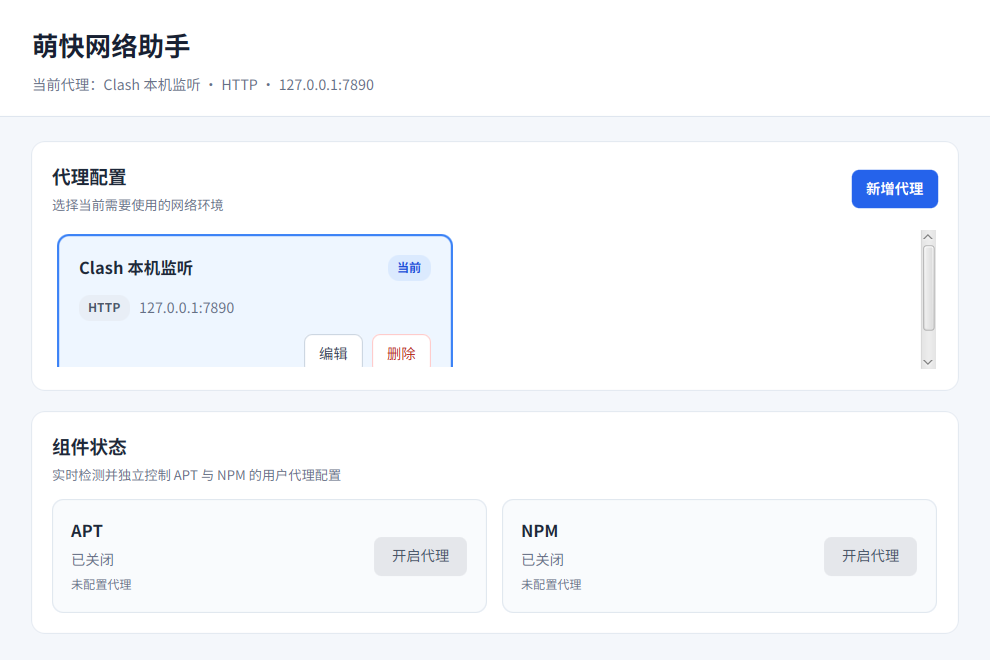

# MoeQuick Gate

MoeQuick Gate（萌快网络助手）是一款面向 Linux 开发者的网络代理配置助手。

当前版本：v0.1.0 MVP。应用已支持代理配置持久化、APT/NPM 代理控制、统一命令执行、结构化错误提示和文本操作日志。

组件控制支持 HTTP、HTTPS 代理；SOCKS5 配置可以保存，但暂不能应用到 APT/NPM。



## 开发环境

- Ubuntu 24.04 x86_64
- OpenJDK 21（需要包含 `javac`、`jlink` 和 `jpackage`）
- `fakeroot`、`binutils` 和 `dpkg-deb`
- `policykit-1`（deb 会自动安装，APT 修改时按需授权）
- `npm`（可选，仅使用 NPM 组件时需要）

Ubuntu 安装命令：

```bash
sudo apt-get update
sudo apt-get install -y openjdk-21-jdk fakeroot binutils policykit-1
command -v java javac jlink jpackage fakeroot dpkg-deb pkexec apt-config
```

项目通过 Gradle Wrapper 固定构建工具版本，无需单独安装 Gradle。

需要使用 NPM 组件时再安装：

```bash
sudo apt-get install -y npm
command -v npm
```

## 安装 v0.1.0

从 [GitHub Release v0.1.0](https://github.com/MoeQuickStudio/moequick-gate/releases/tag/v0.1.0) 下载以下两个文件：

```text
moequick-gate_0.1.0_amd64.deb
moequick-gate_0.1.0_amd64.deb.sha256
```

在下载目录校验并安装：

```bash
sha256sum --check moequick-gate_0.1.0_amd64.deb.sha256
sudo apt install ./moequick-gate_0.1.0_amd64.deb
```

安装后可从桌面应用菜单打开 “MoeQuick Gate”，也可以运行：

```bash
/opt/moequick-gate/bin/moequick-gate
```

使用相同命令安装更高版本 deb 即可升级。卸载应用：

```bash
sudo apt remove moequick-gate
```

卸载软件包不会删除用户代理数据库和操作日志。它们仍分别保存在 XDG data 与 state 目录，需要时由用户自行备份或清理。

## 运行与测试

```bash
./gradlew run
./gradlew clean test build
```

## 数据存储

SQLite 数据库默认保存在：

```text
$XDG_DATA_HOME/moequick-gate/moequick-gate.db
```

未设置有效的绝对 `XDG_DATA_HOME` 时，使用：

```text
~/.local/share/moequick-gate/moequick-gate.db
```

首次建库会创建并选中一条 Clash 本机监听示例。数据库无法使用时，应用会显示警告并降级到不会持久化的内存模式。

开发时可使用临时目录，避免修改真实用户数据和状态文件：

```bash
mkdir -p /tmp/moequick-gate-dev/data /tmp/moequick-gate-dev/state
XDG_DATA_HOME=/tmp/moequick-gate-dev/data \
XDG_STATE_HOME=/tmp/moequick-gate-dev/state \
NPM_CONFIG_USERCONFIG=/tmp/moequick-gate-dev/npmrc \
./gradlew run
```

## 组件代理控制

APT 使用应用专属配置文件：

```text
/etc/apt/apt.conf.d/99zz-moequick-gate
```

开启 APT 代理时会通过 `pkexec` 弹出系统授权；应用不会以 root 身份启动，也不会执行 `apt update`。关闭时保留该文件并为 HTTP/HTTPS 写入 `DIRECT`，从而保持直连。

NPM 通过官方的用户级 `npm config --location=user` 管理 `proxy` 和 `https-proxy`。关闭时将两项设置为 `null`，不会恢复启用前的旧代理值，也不会修改项目级 `.npmrc`、全局配置或环境变量。如果环境变量中仍有代理，界面会显示“其他代理正在生效”。

查看实际状态：

```bash
apt-config dump | grep -i 'Acquire::.*::Proxy'
npm config get proxy --location=user
npm config get https-proxy --location=user
```

切换当前代理时，已经开启的组件会先应用新配置，成功后再保存选择。编辑当前代理采用同样规则；删除当前代理前会先关闭已开启组件。任一步失败时，应用会尽力恢复原代理并显示原因与处理建议。

所有系统命令均以参数列表直接执行，不经过 Shell。普通命令最多等待 10 秒，APT 授权最多等待 120 秒；超时或中断会终止命令进程及其子进程。命令输出会分离读取，每路最多保留 256KB。

## 操作日志

开启、关闭、选择或编辑后的自动重应用以及事务回滚会写入 UTF-8 单行日志。日志不包含完整命令、原始命令输出、环境变量，也不记录五秒周期检测和纯代理 CRUD。

默认日志路径：

```text
$XDG_STATE_HOME/moequick-gate/operations.log
```

未设置有效的绝对 `XDG_STATE_HOME` 时，使用：

```text
~/.local/state/moequick-gate/operations.log
```

日志最多占用 200KB，超限时删除最旧的完整记录。新建目录和文件分别使用 `0700`、`0600` 权限；日志不可写时，应用会持续显示路径和原因，但已经成功的代理操作不会因此回滚。

诊断命令：

```bash
tail -n 50 "${XDG_STATE_HOME:-$HOME/.local/state}/moequick-gate/operations.log"
stat -c '%a %s %n' "${XDG_STATE_HOME:-$HOME/.local/state}/moequick-gate/operations.log"
```

## 运行时镜像

生成包含 Java 和 JavaFX Runtime 的裁剪镜像：

```bash
./gradlew jlink
./build/image/bin/moequick-gate
```

## deb 打包验证

```bash
./gradlew jpackage
sha256sum build/jpackage/moequick-gate_0.1.0_amd64.deb \
  > build/jpackage/moequick-gate_0.1.0_amd64.deb.sha256
dpkg-deb --info build/jpackage/moequick-gate_0.1.0_amd64.deb
dpkg-deb --contents build/jpackage/moequick-gate_0.1.0_amd64.deb
```

deb 包含应用桌面入口、正式图标、MIT 许可证，以及 Java、JavaFX 和 SQLite 所需 Runtime。目标平台为 Ubuntu 24.04 x86_64。

## 当前边界

- 不进行代理网络连通性测试。
- 不支持使用 SOCKS5 控制 APT/NPM。
- 不提供日志查看或清空 UI；请使用系统文本工具诊断。
- 不支持 Git、Pip、Docker 或其他组件。
- 不包含自定义 PolicyKit 规则，也不执行 `apt update`。

## 许可证

MoeQuick Gate 使用 [MIT License](LICENSE)。
